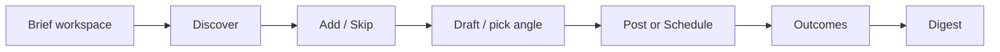
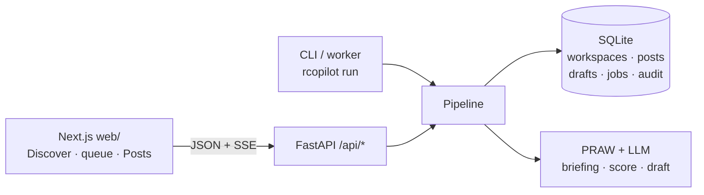

# Reddit Copilot — Product Plan

**Status:** Phase 2 in progress. Variants, live Discover/Posts streams, and vernacular matching shipped. Next: weekly digest.  
**Product:** Open-source, local-first Reddit engagement assistant  
**Later:** Optional hosted cloud service

---

## Vision

For indie founders, developer advocates, and people who want to show up on Reddit as themselves — who know the right threads are out there, but can’t spend hours browsing, and won’t run a spam bot that gets them banned.

**Job to be done:** Continuously find threads that match what this workspace is for (a product, you as a person, or a custom aim) → you pick what to engage → draft in that workspace’s voice → edit and post now or schedule safely.

**Why now:** GummySearch is gone (thread/intent discovery vacuum), Reddit’s API is tighter, LLMs are good enough that your job is judgment not typing — and local OSS with *your* Reddit OAuth tokens is one of the few lanes Reddit still leaves open.

---

## Positioning

**One-liner:** It finds intent threads for the workspace you’re in. You add the ones worth answering, draft in that voice, and nothing posts until you hit Post or Schedule.

**Category:** Human-in-the-loop Reddit engagement assistant — with autonomous discovery and on-demand drafting (open source, local-first).

**Feels like:** A background agent (Polsia-style “it keeps finding work”).  
**Behaves like:** A copilot — human gate on every publish.

**Not this:**

- Not a karma bot
- Not a brand-alert / social-listening SaaS (Syften)
- Not fully autonomous “AI posts for you” with no human publish step (Polsia / Growvia / Blitz)
- Not a multi-platform AI social team
- Not a generic content calendar (Postpone’s lane) — scheduling only delays a reply you’ve already written and chosen to send

---

## Market scope

| Need | Decision | How it shows up |
|------|----------|-----------------|
| **1. Find threads that match this workspace** | **Build** | Briefing-driven intent discovery, keyword/topic filters, question radar → Discover triage |
| **2. AI drafts replies, human posts** | **Build (core)** | Add to queue → Draft/Regenerate (streamed) → edit → Post or Schedule; nothing ships without you |
| **3. Keyword / brand alerts** | **Skip** | No always-on “ping me forever” monitoring inbox — leave that to Syften |
| **4. Schedule Reddit posts** | **Build** | Schedule a drafted reply for later — the scheduler is a delay, not autopilot |

**Autonomy we steal from Polsia (safe):**

- Always-on **discover** (fetch + rank intent threads)
- **On-demand draft** when you open a queued thread (streamed, 2–3 pickable angles, editable)
- **Live Discover + Posts** — threads and self-post ideas appear as they are ready, not after the whole round
- **Weekly digest** of what was found / drafted / posted / how it performed

**Autonomy we refuse:**

- Auto-posting comments or posts without a per-item Post / Schedule action
- Auto-drafting every matched thread into a full reply without you choosing it
- “Reply to everything” / engagement farming

---

## Personas

| Persona | Goal | Pain | Success |
|--------|------|------|---------|
| **Maya** — indie SaaS founder | 3–5 helpful comments/week in niche + founder subs | Opens Reddit “for 10 min,” loses an hour; can’t find buying-intent threads | A **product** workspace fills Discover; 15-min weekly Add → Draft → Post; some become DMs/signups; replies scheduled for peak hours |
| **Dev** — developer advocate | Be the helpful expert without sounding corporate | Closed $49/mo tools store Reddit creds on someone else’s server | Runs locally; a workspace briefing matches how he talks; audit log for his manager |
| **Alex** — IC / job seeker | Show up as yourself in career and hobby subs | “Product voice” makes personal comments feel like ads | A **personal** workspace; drafts sound like them, not a company |
| **Priya** — solo marketer (2 clients) | Find intent threads per client, prove value | One voice/config for everything; no tracking; posting at bad times | One **workspace per client**; scheduled sends; monthly outcomes export |

---

## Core loop



```
Workspace briefing → Discover (live) → Triage → Add / Skip → Draft / pick angle → Post now | Schedule | Original post → Learn → Digest
```

Users live in **Discover + the review queue**, not on reddit.com. Reddit sign-in and the LLM key are **account-level**. Each **workspace** (product, personal, or custom) has its own briefing, goals, subreddits, drafts, and queue.

1. **Brief once** — pick a purpose, talk to the onboarding agent (links welcome). Copilot proposes a name, briefing, goals, communities, and keywords; you edit, then it fetches.
2. **Discover (autonomous)** — pull threads that match *this workspace’s* briefing and search language. Cards stream in as Reddit returns them.
3. **Triage** — rank and hide noise in Discover.
4. **Add / Skip (human)** — pick which threads enter the review queue; skip the rest. The worker never drafts a thread you did not Add.
5. **Draft / Edit (human + LLM)** — generate a streamed reply in the workspace voice, pick an angle, edit it. Reject anything that doesn’t fit.
6. **Post now, schedule, or compose** — the only hard gate before anything reaches Reddit; scheduler is a delay, not autopilot. Original self-post ideas stream in the same way.
7. **Learn + digest** — outcomes improve discovery/drafts; weekly summary pulls the user back.

---

## Feature map

### P0 — Revival (OSS v1) — shipped

| Feature | Pillar | Why it matters |
|--------|--------|----------------|
| **Purpose-based workspaces** | 2 | Product, personal, or custom — each with its own briefing, goals, subs, drafts, and queue |
| **Agent briefing interview** | 2 | Short chat (paste links) → proposed workspace you can edit; agent advances when it has enough |
| **Intent / keyword thread discovery** | 1 | Find threads that match this workspace (GummySearch gap) |
| **Autonomous fetch + Discover triage** | 1 | Live SSE fetch fills Discover as threads land; skeleton cards until the round ends. Worker fetch + due schedules only — no auto-draft |
| **Relevance scoring & intent labels** | 1 | Rank by briefing + saved search language (not exact slogans); tag question / looking-for-tool / complaint / unanswered |
| **Add → Draft → Post review UI** | 2 | Queue threads, stream draft, pick 2–3 angles, edit, reject, post/schedule — review *is* the product |
| **Original self-posts** | 2 | Write or generate a post (ideas stream in one at a time), then post now or schedule — same human gate |
| **Safe posting guardrails** | 2 | Rate limits, cooldowns, no double-reply, allowlists |
| **Schedule drafted comments & posts** | 4 | Queue a drafted reply or self-post for a future time; best-time hints per sub |
| **Outcome tracking** | 2 | Poll posted comments for score, replies, removals |
| **Audit log** | 2 | Every queue, draft, edit, post, schedule event in SQLite |
| **Local onboarding** | 2 | Connect Reddit + LLM once; then purpose → interview → review → first fetch |

### P1 — Differentiate (OSS v1.x)

| Feature | Pillar | Why |
|--------|--------|-----|
| **Draft variants** | 2 | **Shipped.** 2–3 named angles per queued thread; pick instead of rewrite. Worker does not draft Discover matches. |
| **Question radar** | 1 | Unanswered chip + scoring boost exist. Remaining: unanswered-first sort / dedicated mode, and show score + reasons in Discover |
| **Weekly digest** | 2 | **Next.** Found / drafted / posted / outcomes (in-app + optional Slack/email webhook) — not brand alerts |
| **Local LLM (Ollama) as a first-class path** | 2 | Private drafting without a cloud key (base_url already works) |
| **Multi-account routing** | 2 | Per-Reddit-account queues and schedules (workspaces already split *aims*) |

### P2 — Compound (OSS v2)

| Feature | Pillar | Why |
|--------|--------|-----|
| **Saved discovery searches** | 1 | Reusable “find threads like this” inside a workspace |
| **Reply follow-ups** | 2 | Draft follow-ups when someone replies to you (still human publish) |
| **Draft memory** | 2 | Learn from edits/rejections over time |
| **Export & reporting** | 2 | Client / team reports |
| **Calendar view for schedule** | 4 | See what’s queued by day/account |
| **Plugin hooks** | 1–2 | Custom scorers / discovery in Python |

### P3 — Cloud (later)

| Feature | Why people pay |
|--------|----------------|
| Hosted always-on discover + schedule runner | Laptop off; discovery and schedules still run |
| Mobile-friendly review / post | 10-minute review from phone |
| Team review / roles | Agencies & DevRel |
| Cross-account analytics | Aggregated insight |
| Managed LLM | No API key setup |
| Compliance / audit exports | Regulated teams |

Same loop. Human still chooses every publish. Cloud hosts the worker, not the judgment.

---

## Explicit non-goals

- Never post, upvote, or DM without a per-item Post / Schedule action
- No vote manipulation, proxies, account rotation, fingerprint evasion
- No “reply to everything,” no karma targets
- No scraping outside the official API / no reselling user data
- **No keyword / brand-alert product** (Syften’s lane)
- No Twitter/LinkedIn/multi-network “AI social team” (Polsia’s lane)
- Scheduling is Reddit-first and engagement-first — not a multi-network content calendar

---

## Success metrics

### OSS

- ~500 stars by end of Phase 3
- Clone → first posted **or scheduled** comment ≥ 20%
- Weekly active users (opt-in): 100 by v1.x
- ≥ 3 posted or scheduled replies / active user / week
- Post rate from queued threads ≥ 40% (below that, discovery or drafting is broken)
- Rising share of posts from intent-matched threads
- Zero reported bans from guardrail-compliant use

### Cloud (later)

- Waitlist from OSS users
- Trial → paid ≥ 5%
- 90-day retention ≥ 60%

---

## Roadmap

| Phase | Weeks | Focus | Exit criteria |
|------|-------|-------|---------------|
| **1 — Revival** | 1–4 | P0: workspaces + agent briefing + auto discover + Add/Skip + streamed draft review + original posts + schedule + docs | **Done.** Dogfood posted/scheduled from a product workspace; Show HN / r/SideProject |
| **2 — Differentiate** | 5–10 | **Shipped:** no worker auto-draft, pickable variants, live Discover/Posts streams + skeletons, vernacular matching. **Remaining:** digest, radar polish, first-class Ollama, multi-account | ≥40% post rate from queued threads; 50 WAU; 3 “switched from X” notes |
| **3 — Compound** | 11–18 | Saved searches, follow-ups, memory, calendar, plugins, export | 100 WAU; community PRs; cloud waitlist ≥200 |
| **4 — Cloud alpha** | 19–28 | Hosted discover/schedule runner + mobile review; paid from day one | 20 paying users; no ToS incidents; decide continue vs OSS-only |

---

## Tech stack

**Principle:** Python owns Reddit, LLM, storage, and workers. **Next.js** owns the review UI (OSS and cloud). One frontend stack end-to-end — no Flask UI.

### Phase 1–2 (OSS — locked)

| Layer | Choice | Why |
|------|--------|-----|
| Backend language | **Python 3.10+** | PRAW ecosystem; pipeline + worker stay here |
| Package / CLI | `rcopilot` via `pyproject.toml` | `fetch` / `draft` / `run` / `post` / `serve` |
| HTTP API | **FastAPI** | JSON + SSE for Discover fetch, Posts generate, and draft streaming |
| Frontend | **Next.js (App Router) + TypeScript** | Workspaces, Discover, review queue (variants), streaming draft, Posts generate, schedule — same UI path as cloud |
| Autonomy worker | **CLI daemon** (`rcopilot run`) or cron | Discover + due schedules; drafting is on-demand in the UI after Add |
| Reddit API | **PRAW** + web-app OAuth (refresh token) | Browser Connect Reddit; no password; local `.env` |
| LLM | **OpenAI-compatible HTTP** (`openai` SDK) | OpenAI / Groq / OpenRouter / **Ollama** via `base_url`; streamed drafts |
| Storage | **SQLite** | Zero ops; workspaces, posts, drafts, audit, schedule queue |
| Config | `config.yaml` **+** `.env` | Non-secrets vs secrets; gitignore-safe |
| Scheduler | **SQLite due jobs + worker tick** | Drafted items with `run_at`; no Celery yet |
| Local DX | `rcopilot serve` starts API; `npm run dev` in `web/` for UI (or a small compose script) | Two processes is fine for OSS |


**Repo layout (target):**

```
rcopilot/          # Python: pipeline, store, PRAW, LLM, FastAPI
web/               # Next.js review app
```

**Explicitly not for Phase 1:** Flask templates, Postgres, Redis/Celery, multi-platform OAuth, Electron, rewriting Reddit/LLM logic in Node.

### Phase 3 (OSS compound)

| Add | When |
|-----|------|
| Optional **Postgres** | Only if SQLite becomes a real limit for power users |
| **Plugin hooks** (Python entry points) | Custom scorers / discovery |
| Webhook digest | Slack/Discord from the Python worker |
| Next.js polish | Calendar view, denser keyboard review, mobile layout |

### Phase 4 (Cloud)

| Layer | Choice | Why |
|------|--------|-----|
| API | Same **FastAPI** core | Don’t fork business logic |
| DB | **Postgres** | Multi-tenant |
| Jobs | **Redis + worker** (RQ/Arq/Celery) or managed queue | Always-on discover/schedule |
| Auth | User accounts + **BYO Reddit credentials** first | Survive without commercial Reddit API |
| Frontend | Same **Next.js** app, hosted | Mobile-friendly review; team features |
| LLM | BYO key + optional managed key | Onboarding for non-devs |

### Architecture sketch



Worker does **fetch + due schedules**. Drafts start after Add (or Generate ideas on Posts). Discover fetch, Posts generate, and queue drafts stream over SSE.

**Cloud later:** same API + Next app; swap SQLite→Postgres and local worker→hosted worker.

### Stack decision (locked)

- **Backend:** Python + FastAPI + PRAW + SQLite + OpenAI-compatible LLM + background worker  
- **Frontend:** **Next.js + TypeScript** (OSS review UI from day one)  
- **Not:** Flask UI; not a Node rewrite of Reddit/LLM core

---

## Open decisions (non-blocking for Phase 2)

1. **Name** — keep *Reddit Copilot*, or rename later?
2. **Telemetry** — opt-in anonymous usage in OSS, or fly blind on stars/issues?
3. **Cloud API** — at Phase 4, apply for commercial Reddit API, or stay BYO-credentials forever?

---

## Final recommendation (locked)

Phase 1 around Maya’s **product workspace** is done (including dogfood and Show HN / r/SideProject). Keep the human publish gate. Phase 2 variants and live Discover/Posts streams are in. Next: weekly digest.

**Product in one sentence:** An autonomous Reddit discovery pipeline, scoped to a workspace you brief once, with on-demand drafting (pick an angle) and a human publish gate.
